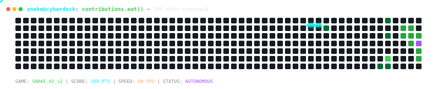

<div align="center">

<!-- iOS 27 Liquid Glass Animated Hero Banner -->


<br /><br />

<!-- Unified CyberDeck OS Dual-Pane Terminal (3D Quantum Core & Neofetch Telemetry - Matches Header Banner Width) -->


<br />

<!-- Autonomous CyberDeck Snake AI Contribution Game (60 FPS, Live Score & Dot Counter) -->
<div align="center">
  
</div>

<br />

</div>

---

<div align="center">

## 🤝 Connect

<a href="https://github.com/exepngsam"></a>
&nbsp;&nbsp;&nbsp;&nbsp;
<a href="https://linkedin.com"></a>
&nbsp;&nbsp;&nbsp;&nbsp;
<a href="mailto:loudbiology@gmail.com"></a>
&nbsp;&nbsp;&nbsp;&nbsp;
<a href="https://portfolio19s.vercel.app/"></a>

<br /><br />

## 💻 Tech Stack

<!-- Row 1 -->
<p align="center">
  
</p>

<!-- Row 2 -->
<p align="center">
  
</p>

<br />

## 📊 GitHub Stats &amp; Telemetry

<!-- 100% Reliable, Self-Contained Animated Stats Matrix & Activity Wave -->


<br /><br />

<!-- Dedicated CyberDeck Live Streak & Weekly Velocity Spectrum Card -->


</div>

---

## 🚀 Featured Platforms &amp; Systems

<div align="center">

<!-- Totally Animated Projects Dashboard Card (Screenshot 4) -->


</div>

<br />

<!-- Direct Clickable Links & Documentation -->
<table>
  <tr>
    <td width="50%" valign="top">
      <h3>🤖 <a href="https://github.com/exepngsam/Nexora">Nexora</a></h3>
      <p><strong>Autonomous AI Incident Coordination Platform</strong> that turns operational incidents into immediate action. Powered by Featherless AI &amp; Caspian for reasoning, autonomous escalation, and real-time coordination.</p>
      <p>
        <a href="https://nexora-three-mu.vercel.app"><b>🌐 Live Demo</b></a> • 
        <code>TypeScript</code> <code>Featherless AI</code> <code>Next.js</code>
      </p>
    </td>
    <td width="50%" valign="top">
      <h3>🧠 <a href="https://github.com/exepngsam/Stark-Ai">Stark-Ai</a></h3>
      <p><strong>Futuristic Personal AI Operating System</strong> that transforms natural-language commands into automated intelligent workflows, agentic tool execution, and continuous real-time assistance.</p>
      <p>
        <a href="https://starkai-fawn.vercel.app/"><b>🌐 Live Demo</b></a> • 
        <code>TypeScript</code> <code>Agentic AI</code> <code>Automation</code>
      </p>
    </td>
  </tr>
  <tr>
    <td width="50%" valign="top">
      <h3>🔐 <a href="https://github.com/exepngsam/TruthSeal-AI">TruthSeal AI</a></h3>
      <p><strong>Digital Trust &amp; Media Forensics Platform</strong> combining cryptographic verification, AI forensic analysis, provenance tracking, and credential revocation to detect manipulated communications.</p>
      <p>
        <a href="https://truth-seal-ai.vercel.app"><b>🌐 Live Demo</b></a> • 
        <code>Cryptographic Verification</code> <code>Media Forensics</code>
      </p>
    </td>
    <td width="50%" valign="top">
      <h3>🌾 <a href="https://github.com/exepngsam/YieldWay-Ai">YieldWay AI</a></h3>
      <p><strong>100% Serverless AgriTech Logistics Engine</strong> engineered for the 'Bharat Builds' AWS Hackathon. Powered by Amazon Bedrock (GenAI), Next.js, and AWS CDK to mitigate post-harvest supply loss.</p>
      <p>
        <a href="https://frontend-lake-zeta-88.vercel.app"><b>🌐 Live Demo</b></a> • 
        <code>AWS Bedrock</code> <code>AWS CDK</code> <code>Serverless</code>
      </p>
    </td>
  </tr>
  <tr>
    <td width="50%" valign="top">
      <h3>🏙️ <a href="https://github.com/exepngsam/Civicfix-ai">CivicFix AI</a></h3>
      <p><strong>AI-Powered Civic Issue Intelligence &amp; Resolution Engine</strong> built on AWS with automated severity detection, duplicate deduplication, and real-time escalation workflows.</p>
      <p>
        <a href="https://civicfix-ai-roan.vercel.app"><b>🌐 Live Demo</b></a> • 
        <code>AWS Cloud</code> <code>Next.js</code> <code>Issue Deduplication</code>
      </p>
    </td>
    <td width="50%" valign="top">
      <h3>✨ <a href="https://github.com/exepngsam/Portfolio">Terminal OS &amp; Physics Engine</a></h3>
      <p><strong>Brutalist Zero-Bloat Portfolio OS</strong> featuring an interactive local AI chatbot, an 800-node 3D particle physics simulation, and custom system-level UI components.</p>
      <p>
        <a href="https://portfolio19s.vercel.app/"><b>🌐 Live Demo</b></a> • 
        <code>3D Physics Engine</code> <code>Zero-Bloat</code> <code>Local AI</code>
      </p>
    </td>
  </tr>
</table>

---

<div align="center">

```
>>> [CONNECTION ESTABLISHED] ~ ping exepngsam.dev: 0.12ms (status: optimal)
```

**Crafted with pure SMIL vector animations &amp; Liquid Glass iOS aesthetics.**

</div>
