<div align="center">

# ⚡ SAM // ARCHITECT &amp; BUILDER
### 🌌 Autonomous AI Systems • Serverless Edge • Full-Stack Architecture
```text
[ SYSTEM INITIALIZED: CYBERDECK OS v2.4 ] ~ CONNECTED TO GITHUB:@exepngsam
```

[](https://github.com/exepngsam)
[](https://github.com/exepngsam?tab=repositories)
[](https://github.com/exepngsam)
[](https://github.com/exepngsam)

<br />

<!-- Side-by-Side Terminal & Neofetch Cards via HTML Table -->
<table border="0" cellpadding="0" cellspacing="0" style="border: none; background: transparent; width: 100%; max-width: 880px;">
  <tr>
    <td width="50%" align="center" valign="top" style="border: none; padding: 6px;">
      
    </td>
    <td width="50%" align="center" valign="top" style="border: none; padding: 6px;">
      
    </td>
  </tr>
</table>

<br />

<!-- Centered Animated Contribution Activity Calendar -->
<div align="center">
  
</div>

<br />

</div>

---

## 🚀 Featured Platforms & Systems

<table>
  <tr>
    <td width="50%" valign="top">
      <h3>🤖 <a href="https://github.com/exepngsam/Nexora">Nexora</a></h3>
      <p><strong>Autonomous AI Incident Coordination Platform</strong> that turns operational incidents into immediate action. Powered by Featherless AI &amp; Caspian for reasoning, autonomous escalation, and real-time coordination.</p>
      <p>
        <a href="https://nexora-three-mu.vercel.app"><b>🌐 Live Demo</b></a> • 
        <code>TypeScript</code> <code>Featherless AI</code> <code>Next.js</code>
      </p>
    </td>
    <td width="50%" valign="top">
      <h3>🧠 <a href="https://github.com/exepngsam/Stark-Ai">Stark-Ai</a></h3>
      <p><strong>Futuristic Personal AI Operating System</strong> that transforms natural-language commands into automated intelligent workflows, agentic tool execution, and continuous real-time assistance.</p>
      <p>
        <a href="https://starkai-fawn.vercel.app/"><b>🌐 Live Demo</b></a> • 
        <code>TypeScript</code> <code>Agentic AI</code> <code>Automation</code>
      </p>
    </td>
  </tr>
  <tr>
    <td width="50%" valign="top">
      <h3>🔐 <a href="https://github.com/exepngsam/TruthSeal-AI">TruthSeal AI</a></h3>
      <p><strong>Digital Trust &amp; Media Forensics Platform</strong> combining cryptographic verification, AI forensic analysis, provenance tracking, and credential revocation to detect manipulated communications.</p>
      <p>
        <a href="https://truth-seal-ai.vercel.app"><b>🌐 Live Demo</b></a> • 
        <code>Cryptographic Verification</code> <code>Media Forensics</code>
      </p>
    </td>
    <td width="50%" valign="top">
      <h3>🌾 <a href="https://github.com/exepngsam/YieldWay-Ai">YieldWay AI</a></h3>
      <p><strong>100% Serverless AgriTech Logistics Engine</strong> engineered for the 'Bharat Builds' AWS Hackathon. Powered by Amazon Bedrock (GenAI), Next.js, and AWS CDK to mitigate post-harvest supply loss.</p>
      <p>
        <a href="https://frontend-lake-zeta-88.vercel.app"><b>🌐 Live Demo</b></a> • 
        <code>AWS Bedrock</code> <code>AWS CDK</code> <code>Serverless</code>
      </p>
    </td>
  </tr>
  <tr>
    <td width="50%" valign="top">
      <h3>🏙️ <a href="https://github.com/exepngsam/Civicfix-ai">CivicFix AI</a></h3>
      <p><strong>AI-Powered Civic Issue Intelligence &amp; Resolution Engine</strong> built on AWS with automated severity detection, duplicate deduplication, and real-time escalation workflows.</p>
      <p>
        <a href="https://civicfix-ai-roan.vercel.app"><b>🌐 Live Demo</b></a> • 
        <code>AWS Cloud</code> <code>Next.js</code> <code>Issue Deduplication</code>
      </p>
    </td>
    <td width="50%" valign="top">
      <h3>✨ <a href="https://github.com/exepngsam/Portfolio">Terminal OS &amp; Physics Engine</a></h3>
      <p><strong>Brutalist Zero-Bloat Portfolio OS</strong> featuring an interactive local AI chatbot, an 800-node 3D particle physics simulation, and custom system-level UI components.</p>
      <p>
        <a href="https://portfolio19s.vercel.app/"><b>🌐 Live Demo</b></a> • 
        <code>3D Physics Engine</code> <code>Zero-Bloat</code> <code>Local AI</code>
      </p>
    </td>
  </tr>
</table>

---

## 🛠️ Core Tech Arsenal

<div align="center">

| Domain | Technologies |
| :--- | :--- |
| **Languages** | `TypeScript` • `Python` • `JavaScript` • `SQL` • `HTML5 / CSS3` |
| **Frontend &amp; UI** | `Next.js 15` • `React 19` • `TailwindCSS` • `Lucide` • `Canvas / WebGL` |
| **AI &amp; Autonomous Agents** | `Amazon Bedrock` • `Featherless AI` • `Agentic Workflows` • `Media Forensics` |
| **Cloud &amp; Infrastructure** | `AWS (CDK, Lambda, S3)` • `Vercel Edge` • `Serverless Architecture` • `Docker` |
| **Database &amp; Storage** | `PostgreSQL` • `Redis` • `Vector DBs` • `Cloudflare / Edge KV` |

</div>

---

<div align="center">

```
>>> [CONNECTION ESTABLISHED] ~ ping exepngsam.dev: 0.12ms (status: optimal)
```

**Crafted with pure SMIL vector animations &amp; Cyberpunk aesthetics.**

</div>
